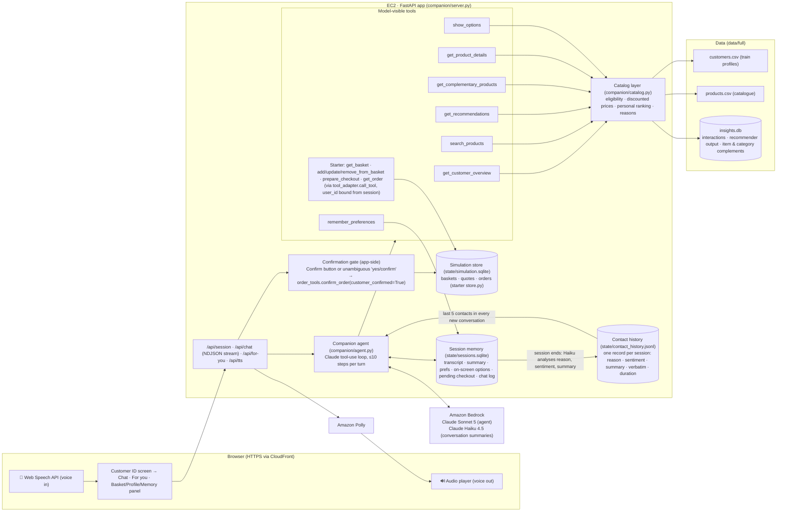

# Lifestyle Companion: solution guide

An agentic AI companion (voice and text) that helps a customer plan a need, discover products, compare
and choose, and complete a simulated purchase with the supplied basket and order functions.

- **Live link:** see `deploy/outputs.json` → `url` (CloudFront HTTPS in front of EC2 in the provided AWS account)
- **Model:** Claude Sonnet 5 on Amazon Bedrock (`us.anthropic.claude-sonnet-5`), adaptive thinking at low effort.
  Set `MODEL_ID` to change it. Sonnet 5.5 and Opus 5.5 are blocked by this account's private-marketplace policy.
- **Voice:** speech-to-text in the browser (Web Speech API: Chrome, Edge, Safari); text-to-speech with Amazon Polly (neural).
  Voice and text go through the same `/api/chat` turn, so they share one conversation, memory and basket.

All prices are shown and spoken in US dollars (USD).

## 1. Agent design



### One turn

1. The app loads this customer's memory and binds `user_id` from the session. The model never supplies it.
2. If a checkout summary is pending and the customer pressed **Confirm**, or wrote or said an unambiguous
   confirmation, the **application** calls `confirm_order(..., customer_confirmed=True)`. The model has no
   tool that can place an order. A message like "remove that item before placing the order" is never treated as confirmation.
3. The user message is sent with an `<app_context>` block: channel (voice or text), remembered preferences,
   the numbered options on screen, the live basket, whether a checkout is pending, and app events
   (for example "order ORD-… created"). The first message of a conversation also carries the customer profile and activity digest.
4. Claude runs its tool loop. Tool results stream to the UI as events: product cards, basket updates,
   the checkout summary with Confirm and Cancel, the order confirmation, and memory chips.
5. Any basket change voids a pending summary, so a new `prepare_checkout` and fresh confirmation are required,
   as the starter also enforces.

### How each requirement is met

| Requirement | Implementation |
|---|---|
| Understand needs | Profile, history and memory are in context; the prompt asks for 1–2 focused follow-ups only when the answer changes the recommendation, and says to use the profile (household, OS, budget, quality) instead of re-asking. |
| Recommend and explain | `get_recommendations` (recommender output) is blended with `search_products` (the current request). Every card has a factual "why": recommender rank, left in cart, favourite, interest match, preferred style or quality, discount. `get_product_details` supports comparisons. |
| Proactive and cross-sell | The session opens with a personalised greeting (cart items still available, favourites on discount, top picks). `add_to_basket` results include `cross_sell_hint` from item and category complements, filtered by eligibility and budget. The **For you** tab shows Home, Shop and Rewards rails. Customers who opted out of marketing only get suggestions tied to their current request. |
| Adapt to feedback | `remember_preferences` stores budget, goal, styles and rejected products. Rejected products are excluded server-side from every later search. "The first option" resolves through the numbered on-screen list. |
| Simulated purchase | The six starter tools go through `tool_adapter.call_tool`; `confirm_order` is called only by the application after explicit confirmation. |
| Memory and context | Memory is per customer and persisted, so switching customers loads that customer's own conversation and basket. Transcripts are append-only; long conversations roll into a new segment with a Haiku summary plus the structured memory. |
| Accuracy | Tools return only products the customer can buy (launch date, region, device OS, already owned), with prices computed like the basket's. Ineligible counts come back as `hidden_counts`. Subscriptions are flagged because the starter disables their checkout. Errors are reported, never shown as success. |

## Just For U (side panel)

| Group | What it shows | Logic |
|---|---|---|
| **Bucks** | Loyalty balance and its value in USD | Every customer starts with **1,000 Bucks**; **10 Bucks = $1**. At checkout the customer can use them with the *Use my Bucks* switch or by asking the companion (tool `apply_bucks`). Bucks are capped at the order total, deducted only when the app creates the order, and deducted once per order even if confirmation is repeated. The order shows Bucks used and the amount paid. Ledger: `state/loyalty.sqlite` (`companion/loyalty.py`). |
| **Next Level** (upsell) | 3 products, minimalist rows | A real step up (higher quality tier, same category, at most 1.8× the price + 10) from items in the basket, or from recent purchases when the basket is empty. Falls back to premium picks in the customer's favourite categories. |
| **For U** (cross-sell) | 3 products, minimalist rows | Items bought together with what is in the basket first, then with past purchases (activity history and orders placed in the app). Limited to the customer's budget, and never something they own, rejected or have in the basket. |

Both lists include only products the customer can buy, and exclude subscriptions (which the simulation can't check out).
The block starts minimised: (+) opens it and (−) minimises it, and while it is closed the (+) blinks and the teaser shows the Bucks balance and number of picks, to invite the customer to open it (the choice is remembered in the browser). Clicking a product sends "Add … to my basket" into the chat, so the companion adds it and can suggest what goes with it.
The block refreshes after every chat turn. Endpoints: `GET /api/just-for-u/{user_id}` and `POST /api/checkout/bucks`.

## Customer portrait ("What I remember")

The top of the *What I remember* card shows a short, warm portrait of the customer, addressed to them as "you". It is two sentences (30–45 words):
- the first affirms their taste: favourite categories and styles, quality preference, loyalty, and the categories they rated highly;
- the second gently invites a next step that fits them, such as finishing a plan they started, items waiting in their favourites, or using their Bucks. There is no pressure or urgency.

Claude Haiku writes it from those signals only (`companion/portrait.py`, `GET /api/portrait/{user_id}`). It never mentions age, household, budget amounts, region or scores. It is cached per customer and rewritten only when the signals change, such as a new goal, a new order or a new rating. A template fallback is used if the model is unavailable.

## Feedback framework (JNPS and xNPS)

Both surveys use a **1–10 scale**: 1–6 **detractor**, 7–8 **neutral**, 9–10 **promoter**. NPS = % promoters − % detractors.

| Survey | What is rated | When it is pushed | Where |
|---|---|---|---|
| **JNPS** (Journey NPS) | One past purchase, treated as a journey: "How likely are you to recommend *Kitchen 11* to a friend or family member?" | On **login** and on **New chat**. Picks the most recent purchase not yet rated or dismissed: orders placed in the app first, then purchases from the activity history. An unanswered survey is offered again rather than duplicated. | Card in the chat (10 colour-coded buttons, optional comment, *Not now*) |
| **xNPS** (experience NPS) | The whole session with the companion | When the customer clicks **New chat** or **Switch**, if they spoke to the companion in this session | Modal dialog (optional comment, *Skip*) |

**Closing the loop.** After a JNPS answer the companion replies straight away:
- detractor: an apology and a better-rated or higher-quality alternative;
- neutral: a question about what would have made it better;
- promoter: thanks and an optional complementary pick.

Every answer goes into `<customer_feedback>` in each new conversation. The companion then avoids low-rated products (and very similar ones), favours categories the customer rated highly, and keeps things concise after a low session rating. The xNPS score is also stored on that session's contact-history record (`xnps`).

**Survey history for reporting.** Every survey shown is kept in `state/feedback.sqlite` (table `surveys`), including dismissed and still-pending ones, so the response rate can be measured. Columns:
- the survey: `survey_id`, `survey_type` (JNPS / xNPS), `customer_id`, `status` (answered / dismissed / pending), `score`, `nps_category`, `comment`, `question`, `shown_at`, `responded_at`, `trigger` (login / new_chat / switch);
- for JNPS, the purchase: `product_id`, `product_name`, `product_category`, `product_domain`, `order_id`, `purchase_source` (app_order / purchase_history), `purchased_at`;
- for xNPS, the session: `contact_id`, `session_turns`, `session_orders`;
- customer attributes for slicing: `region`, `membership_tier`, `age_band`, `device_os`.

| Endpoint | Returns |
|---|---|
| `GET /api/feedback/report` | Per survey type: shown, answered, dismissed, pending, response rate, NPS, average score, promoters, neutrals and detractors, score distribution, NPS by day, by membership tier and by region (JNPS also by product category and product; xNPS also by trigger), and recent comments |
| `GET /api/feedback/export.csv` | Every survey row (semicolon-separated) for BI tools |

## Contact history

Every customer session with the companion becomes one **contact record**, appended to
`state/contact_history.jsonl` (JSON Lines, one contact per line) on the server.
`python deploy/deploy.py fetch-contacts` copies the live file to `data/contact_history.jsonl`.
Per-customer download: `GET /api/contacts/{user_id}/export.csv`
(semicolon-separated, verbatim flattened to one cell). Full records for one customer: `GET /api/contacts/{user_id}?verbatim=true`.

| Field | Content |
|---|---|
| `contact_id`, `customer_id` | Record ID and the session's customer ID |
| `started_at`, `ended_at` | UTC ISO timestamps of the first and last message of the session |
| `duration_seconds` | `ended_at − started_at` |
| `channel`, `turns` | `text`, `voice` or `mixed`; number of customer messages |
| `reason`, `reason_category` | Why the customer got in touch (short phrase plus a category such as `product_discovery`, `purchase`, `order_inquiry` or `complaint_or_issue`) |
| `sentiment`, `sentiment_score`, `sentiment_rationale` | `positive` / `neutral` / `negative` / `mixed`, a score from −1 to 1, and the reason for it |
| `summary`, `resolved`, `follow_up` | Context summary for the next agent, whether the need was met, and a suggestion for next time |
| `outcome` | Orders placed (ID, items, total) and basket actions, recorded by the app, not inferred |
| `preferences` | Budget, goal, styles and rejected products captured during the session |
| `verbatim` | Every message with timestamp, speaker (customer or companion), channel and product cards shown |

**When a session ends:** the customer presses *New chat* or *Switch*, or has been inactive for 10 minutes
(`CONTACT_IDLE_SECONDS`), checked by a background sweeper and again when they return. Sessions where the customer
never spoke are not recorded. The factual fields come from the app. Reason, sentiment and summary come from
Claude Haiku 4.5 reading the transcript, with a heuristic fallback if the model call fails.

**How it personalises:** the customer's last five contacts go into the first message of every new conversation
(`<contact_history>`). The companion is instructed to:
- pick up earlier threads ("how is the kitchen coming along?");
- address a negative or unresolved last contact first, with extra patience;
- not re-suggest products the customer rejected;
- reuse the budget and preferences they gave before;
- never read the record or the sentiment labels back to the customer.

Preferences also carry over between sessions (except after *New chat*). The history is not shown in the
customer interface; it is used only by the companion and available through the file and endpoints above.

## 2. Run locally

Requires Python 3.10+ and AWS credentials with Bedrock (Claude Sonnet 5, Haiku 4.5) and Polly access.

```bash
pip install -r requirements-app.txt
export AWS_REGION=us-east-1            # plus AWS credentials
uvicorn companion.server:app --port 8000
# open http://localhost:8000 and enter a customer ID such as U000001
```

Data: `data/full/customers.csv` (train), `data/full/products.csv`, and `data/full/insights.db` (interactions,
recommender output and complement tables; SQLite, indexed by user). Runtime state goes to `state/` (`STATE_DIR`).

`insights.db` (194 MB) is not in the Git repository because it exceeds GitHub's 100 MB file limit. Get it from the
deployment bundle in the AWS account:

```bash
aws s3 cp s3://lifestyle-companion-v2-905418279668/app.tar.gz /tmp/app.tar.gz
tar xzf /tmp/app.tar.gz -C . data/full/insights.db
```

The starter's own demo and tests still run unchanged: `python demo.py` and `python -m unittest -v`.
Companion tests: `python -m unittest -v test_companion` (no AWS needed).

## 3. Deploy to AWS

```bash
python deploy/deploy.py create   # S3 bundle, IAM role, SG (CloudFront-only), EC2 t3.medium, CloudFront HTTPS
python deploy/deploy.py update   # re-package and restart via SSM after code changes
python deploy/deploy.py status
```

Resources are all named `lifestyle-companion-v2*`. The instance runs `uvicorn` under systemd as an
unprivileged user; port 80 accepts traffic from CloudFront's origin-facing IP ranges only.

## Files

| Path | Purpose |
|---|---|
| `companion/server.py` | FastAPI endpoints, NDJSON streaming, Polly TTS |
| `companion/agent.py` | System prompt, tool definitions, tool loop, confirmation gate, context and rollover |
| `companion/catalog.py` | Customer insights, eligibility-safe search, recommendations, complements, reasons |
| `companion/memory.py` | Per-customer persisted session memory |
| `companion/portrait.py` | Warm customer portrait for the What I remember panel |
| `companion/feedback.py` | JNPS and xNPS surveys: selection, answers, personalisation context, report and CSV |
| `companion/loyalty.py` | Bucks loyalty ledger (balance, checkout plan, redeem-once per order) |
| `companion/contacts.py` | Contact history: record building, Haiku analysis (reason, sentiment, summary), JSONL and CSV |
| `companion/static/` | Web UI (vanilla JS): login, chat, cards, basket, checkout, voice |
| `deploy/deploy.py` | AWS provisioning and updates |
| `test_companion.py` | Offline tests for eligibility, ranking, memory, confirmation gate, contact history |
| `data/contact_history.jsonl` | Copy of the live contact history (`deploy.py fetch-contacts`) |
| Starter files | `store.py`, `basket_tools.py`, `order_tools.py`, `tool_adapter.py`, `tool_schemas.json` (unchanged) |
